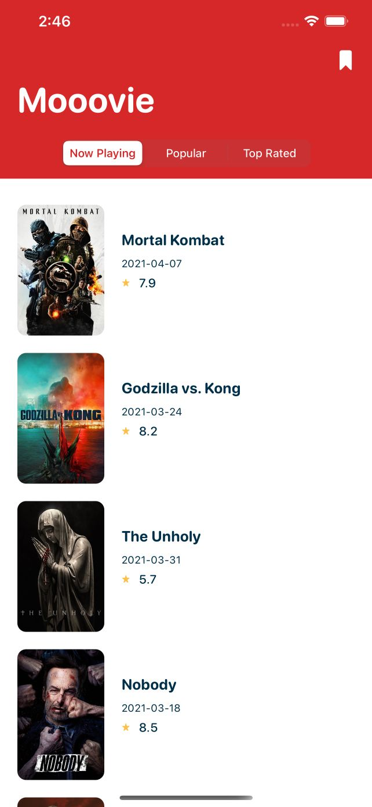
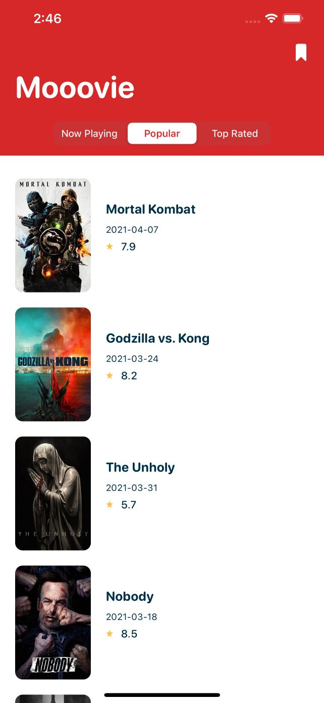
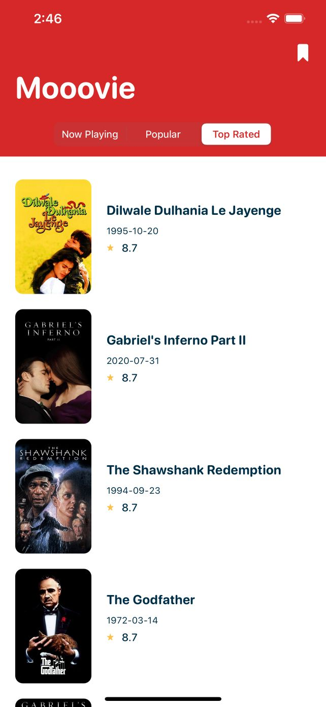
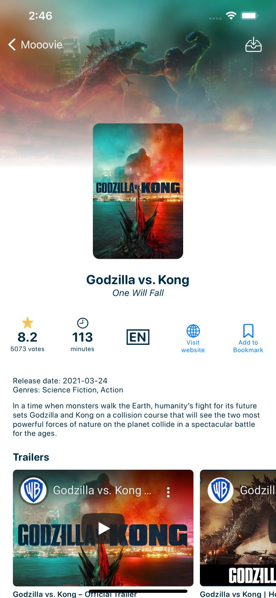

## **Mooovie**

Simple weather app built using:
 - **Xcode** 12.0.1 (12A7300)
 - **Swift** 5
 - **UIKit** (programmatically, no storyboard / interface builder)
 - **RxSwift**
 - **MVVM**
 - **The Movie Database (TMDB) API**

**Screenshots:**

    
    
    

**Features:**
 - Get now playing, popular, and top rated movies
 - Movie details (poster, votes, duration, languages, genres, etc)
 - Download and save poster
 - Visit official website 
 - Watch trailers
